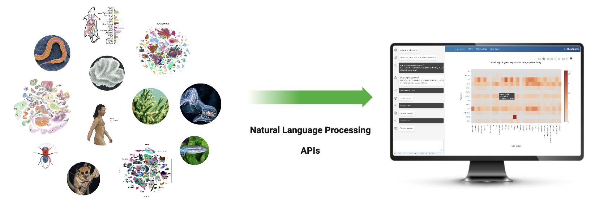

# Introduction 
 

### About

In the last decade, single cell omics have revolutionised biology and medicine, enabling researchers to gain biomedical insight with extreme detail and precision. Nonetheless, new researchers picking up single cell analysis are met with a high entry barrier: months of training in coding, data science, package installation, and so on, resulting is a dramatic slowdown of biomedical research. 

AtlasApprox aims to democratise accessibility to single cell analysis by building a software environment that runs in the user's web browser and delivers biomedical insights within minutes without any requirement for programming literacy. The candidate will achieve this goal by encapsulating fundamental single cell analysis tools in a browser environment using web assembly (WASM) technologies and orchestrating them client-side in Python and JavaScript. Network analysis, high-dimentional data sciene, and deep learning will be combined as required.

### Data Source
TODO: put a list of url where we get the data from

### Home page
When you arrive on the "Cell Atlas Approximations" portal's main interface, you will find a split view layout featuring two main sections: a chat interface and a plot display area.
#### Chat Area
On the left side of the screen is the ChatBox. This area serves as an interactive interface for users to ask questions about cell atlas data. Users can type their queries into the text input area and press 'Enter' to send the question. The system, equipped with an intelligent bot, responds to the queries and displays the answers in this chat history area. This part of the interface keeps a history of all interactions, allowing users to review past questions and responses.

#### Plot Area
Once a user submits a question through the ChatBox, if the response includes a plot, the right side of the screen transitions to display this plot in the PlotBox area. The PlotBox area is dynamically updated to display relevant plots based on the queries and responses in the chat.

### Exploring Mouse Cell Atlas: A Use Case for Navigating Our Platform

In this section, we'll walk you through an example of how you can use our platform to explore genomics data, using the **mouse (Mus musculus)** as our model organism. The steps outlined here are applicable to other species available in our database, and we encourage you to utilize them as a guide for your personalized data exploration.

#### Cell Type Distribution

Query: "What cell types are present in each organ of the mouse?"

This query provides information about the different cell types present in each organ of the mouse.

#### Gene Expression Profile

Query: "What is the expression of Tp53,Mettl14,Apoe,Cd8a,Cd19,Mettl14,Hdac8,Mtor,Hnrnpl,Lancl2 in the mouse lung?"

This query retrieves the average expression of the a list of specified genes in the mouse lung.

#### Gene Presence Ratio

Query: What is the fraction of Aqp1,Slc12a1,Slc22a8,Umod,Podxl,Wt1,Pax2,Slc34a1,Nphs2,Slc12a3,Pkd1,Pkd2,Sglt2,Ren1,Agtr1a,Agtr2 in the mouse kidney?

This query provides the fraction of cells that express each of the specified genes in the mouse kidney.

### Highest Expressor
Query: what cell type is the highest expressor of Apoe in mouse?

#### marker genes

Query: "Show 10 markers of fibroblast in the mouse lung"

This query identifies 10 marker genes for the fibroblast cell type in the mouse lung.

A paragraph with *emphasis* and **strong importance**.

